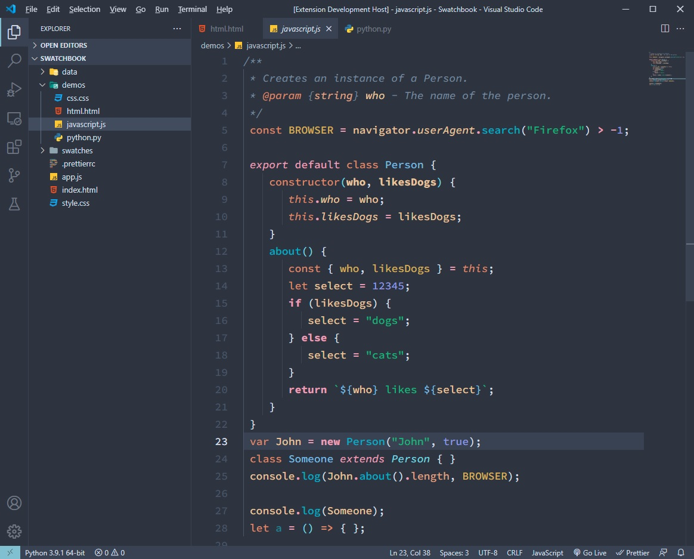
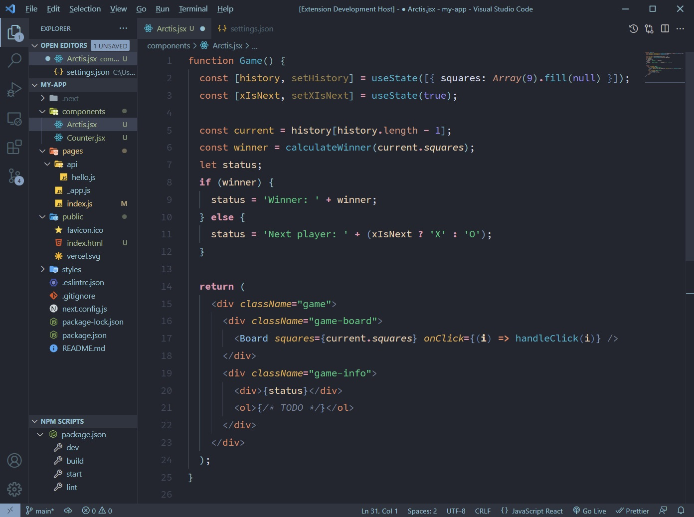

# Arctis Theme

## NORD x NOCTIS

### My two favorite themes put together for comfortable coding all day long.

---

[](https://vscode.dev/theme/avidworks.arctis)

Arctis borrows the brilliant syntax highlighting from Noctis (with color tweaks) and combines it with the beautiful, soothing UI from Nord. The result is what I think is a perfect combination.

Keeping accessibility in mind, most syntax colors maintain at least WCAG 4.5:1 minimum contrast.

### **Arctis**



### **Arctis Dark**



## Includes Nord's theming for the new built in bracket colorizer. Enable the following to use:

```
"editor.bracketPairColorization.enabled": true,
```

## Font settings as shown in screenshots:

```
"editor.fontFamily": "Cascadia Code",
"editor.fontWeight": "350",
"editor.lineHeight": "1.8"
```

## Credits:

Full credit of this theme shared between [Noctis](https://marketplace.visualstudio.com/items?itemName=liviuschera.noctis) and [Nord](https://marketplace.visualstudio.com/items?itemName=arcticicestudio.nord-visual-studio-code), as this is simply a combination of the two but with minor tweaks to fit them together.
