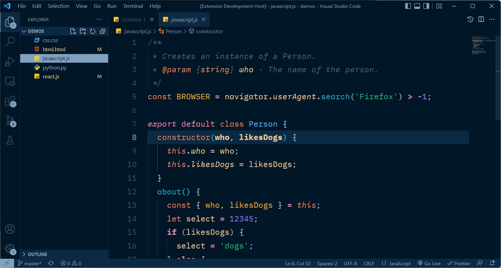
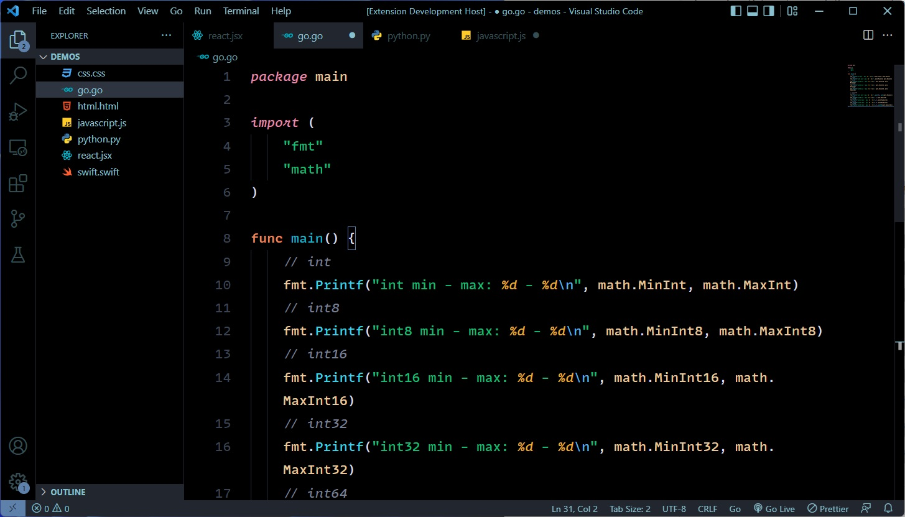
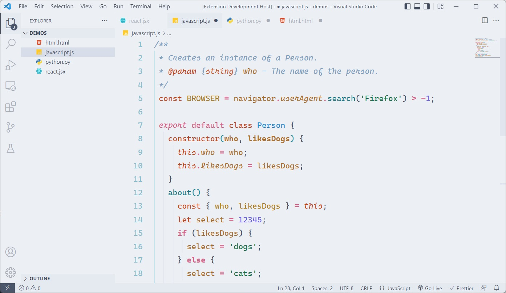

# Arctis Theme

### NORD x NOCTIS

### My two favorite themes put together for comfortable coding all day long.

---

[](https://vscode.dev/theme/avidworks.arctis)

Arctis borrows the brilliant syntax highlighting from Noctis (with color tweaks) and combines it with the beautiful, soothing UI from Nord. The result is what I think is a perfect combination. Includes both a darker version and now a light theme.

Arctis Night borrows from the UI color palette from Sarah Drasner's lovely [Night Owl](https://marketplace.visualstudio.com/items?itemName=sdras.night-owl) theme.

Keeping accessibility in mind, most syntax colors maintain at least WCAG 4.5:1 minimum contrast.

## **Arctis - The all purpose theme**


## **Arctis Dark - For when you want more contrast**


## **Arctis Night - For those late night sessions**



## **Arctis High Contrast - For ultimate contrast**



## **Arctis Light - For those who prefer light themes**



### Font settings as shown in screenshots:

```
"editor.fontFamily": "MonoLisa",
"editor.fontWeight": "500",
"editor.lineHeight": "24"
```

#### Credits:

Full credit of this theme shared between [Noctis](https://marketplace.visualstudio.com/items?itemName=liviuschera.noctis) and [Nord](https://marketplace.visualstudio.com/items?itemName=arcticicestudio.nord-visual-studio-code), as this is simply a combination of the two but with minor tweaks to fit them together.
