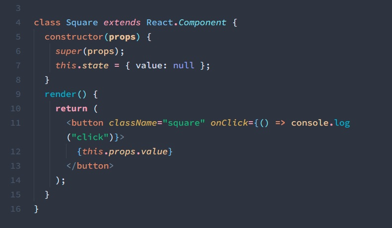

# Arctis Theme

## NORD x NOCTIS

### My two favorite themes put together for comfortable coding all day long.

When working in bright light or using multiple monitors with different foreground brightness, I find that having too dark of a theme can be straining to the eyes. Arctis aims to solve that problem by maintaining strong legibility and contrast in all lighting conditions without relying on switching between dark and light themes.

To accomplish this, it borrows the brilliant syntax highlighting from Noctis (with color tweaks to maintain the original contrast ratios) and combines it with the beautiful, soothing UI from Nord. The result is what I think is truly a perfect combination.

Keeping accessibility in mind, all syntax colors maintain at least WCAG 4.5:1 minimum contrast.

### **Main UI**


### **React**



### **Python**


## Now includes Nord's theming for the new built in bracket colorizer. Enable the following to use:

```
"editor.bracketPairColorization.enabled": true,
```

## Font settings as shown in screenshots:

```
"editor.fontFamily": "Source Code Variable",
"editor.fontWeight": "400",
"editor.lineHeight": "1.5"
```

## Credits:

Full credit of this theme shared between [Noctis](https://marketplace.visualstudio.com/items?itemName=liviuschera.noctis) and [Nord](https://marketplace.visualstudio.com/items?itemName=arcticicestudio.nord-visual-studio-code), as this is simply a combination of the two but with minor tweaks to fit them together.
