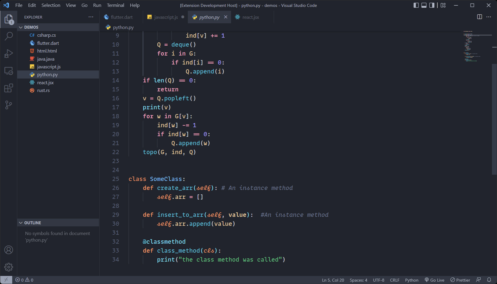
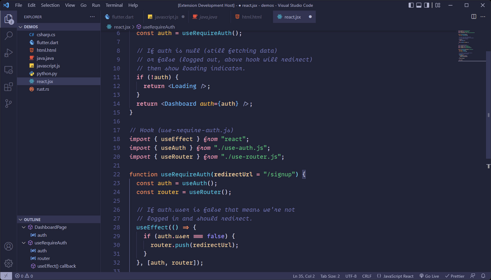
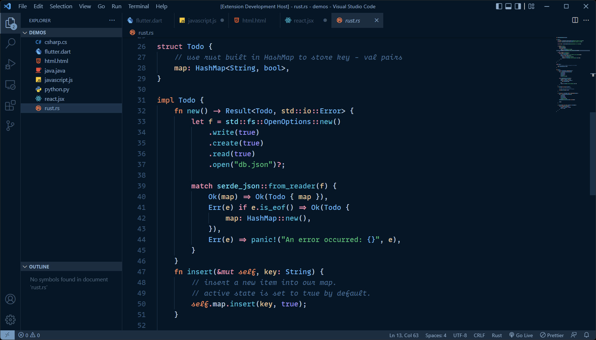
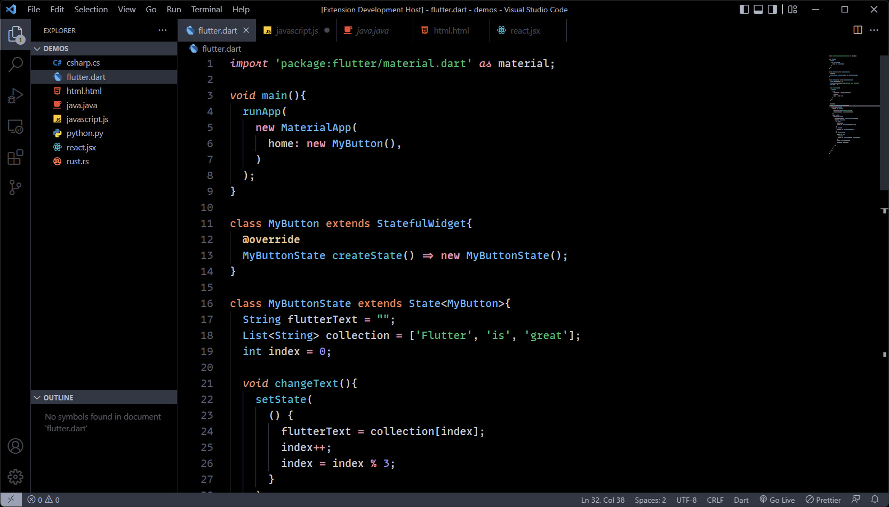
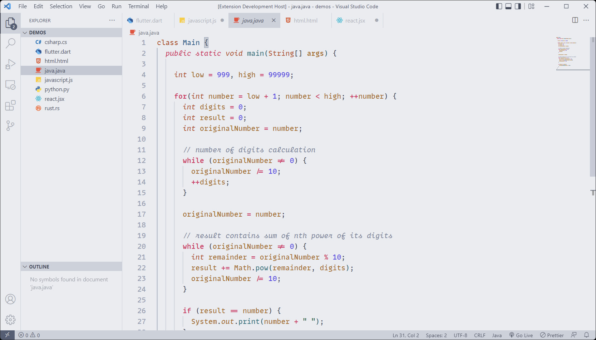

# Arctis Theme

## Nord x Noctis

---

[](https://vscode.dev/theme/avidworks.arctis)

Arctis borrows the brilliant syntax highlighting from Noctis and combines it with Nord's soothing UI colors. Syntax colors were adjusted to closely match Noctis colors but adjusted to maximize readability. The result is what I think is a lovely combination.

Several versions are included, including:

- **Arctis** - Base theme with Nord UI
- **Arctis Dark** - Darkened version of the base theme
- **Artcis Moon** - A moonlit version of Arctis Dark
- **Arctis Night** - Arctis Night borrows from the UI color palette from Sarah Drasner's lovely [Night Owl](https://marketplace.visualstudio.com/items?itemName=sdras.night-owl) theme.
- **Arctis High Contrast** - A solid black background to really make the code stand out.
- **Arctis Light** - Light variant of the base theme for those who prefer them.

Keeping accessibility in mind, most syntax colors maintain at least WCAG 4.5:1 minimum contrast.

## **Arctis**


## **Arctis Dark**



## **Arctis Moon**



## **Arctis Night**



## **Arctis High Contrast**



## **Arctis Light**



### Font settings as shown in screenshots:

```
"editor.fontFamily": "MonoLisa",
"editor.fontWeight": "500",
"editor.lineHeight": "24"
```

#### Credits:

Full credit of this theme shared between [Noctis](https://marketplace.visualstudio.com/items?itemName=liviuschera.noctis) and [Nord](https://marketplace.visualstudio.com/items?itemName=arcticicestudio.nord-visual-studio-code), as this is simply a combination of the two but with minor tweaks to fit them together.
